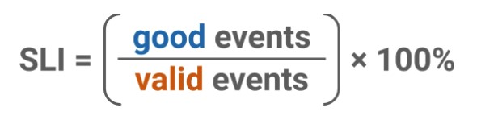
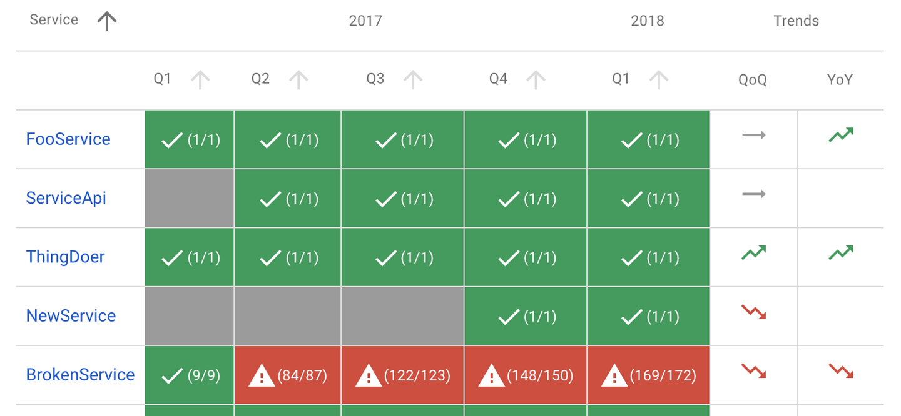
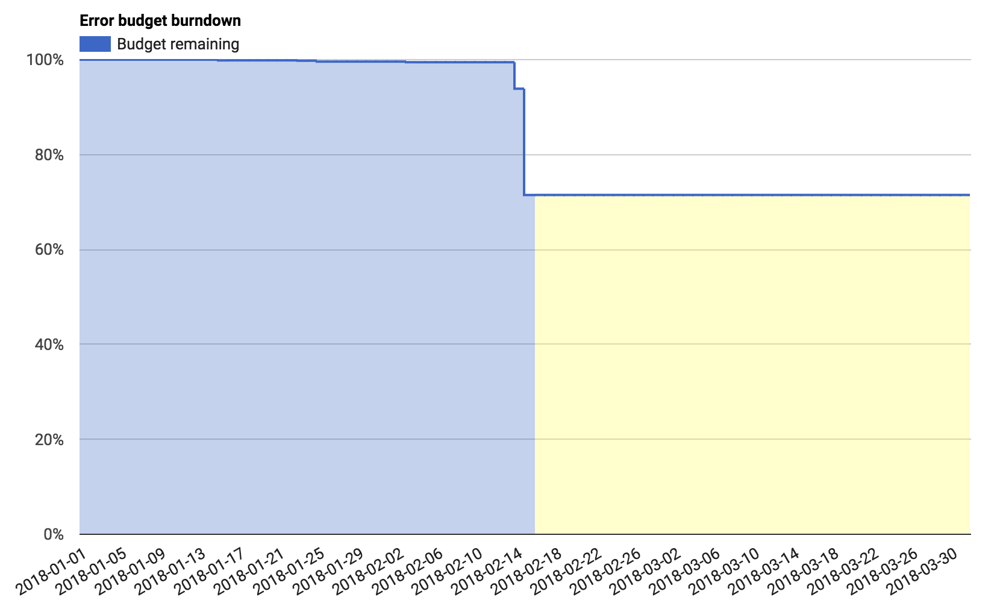

## 1. Измеряемость надежности сервиса
Для создания надежных систем надо каким-то образом измерять эту надежность, поскольку *you can't improve what you don't measure*. Для этого введены такие понятия как **SLI**, **SLA**, **SLO** и **бюджет ошибок**:

### 1.1. SLI (Service Level Indicator)
`SLI` - это **количественная оценка работы сервиса**, которая максимально близко должна отражать пользовательский опыт с сервисом. **SLI** можно воспринимать как отношение *хороших событий* (*good events*) к *допустимым собитиям* (*valid events*):

Формула **SLI** варьируется в зависимости от того, что мы хотим измерять. Например, хотим ли мы измерять время отклика от сервиса или доступность сервиса.

В разных ситуациях *хорошие события* и *допустимые собития* варьируются.
Например, для **SLI** доступности сервиса:
1. *хорошими событиями* можно считать те отклики от сервиса, коды откликов которых не равны 5XX,
2. *допустимыми собитиями* можно считать все запросы, которые попали на сервис от клиента.

### 1.2. SLO (Service Level Objective)
`SLO` - это **внутренний желаемый целевой показатель** нашего **SLI**, который обычно устанавливается в зависимости от нужд бизнеса.**SLO** не является константой, иногда его надо изменять, например:
1. **SLO** можно увеличить если текущий целевой показатель всегда достигается, тем самым увеличиваем надежность сервиса.
2. Допустим интернет-магазин имеет **SLO** на уровне 99.9%. А для "черной пятницы", добавляя дополнительные вычислительные мощности, **SLO** можно увеличить до уровня 99.95%, тем самым интернет-магазин будет готов к большему наплыву покупателей.

**SLO** позволяет нам балансировать между разработкой нового функционала сервиса и работой над надежностью. Почти никогда **SLO** не надо устанавливать на уровне 100%, поскольку при 100% мы не сможем добавлять новый функционал сервиса.

Таблица **SLO** нам помогает визуально понимать какие сервисы соответствуют уровню **SLO**, а какие нет. Ниже на картинке показан пример таблицы, где показаны 5 микросервисов за последние 5 кварталов. Зеленый цвет показывает соответствие уровню **SLO**, красный цвет показывает несоответствие уровню **SLO**. **QoQ** - индикатор изменения показателя **SLI** последнего квартала по сравнению с предыдущим кварталом. **YoY** - индикатор изменения показателя **SLI** последнего квартала по сравнению с таким же кварталом предыдущего года.

### 1.3. SLA (Service Level Agreement)
`SLA` - это **соглашение бизнеса с пользователями об уровне обслуживания**, в котором также прописан уровень **SLI**, который гарантирует бизнес. Уровень **SLO** должен быть не меньше уровня обслуживания, который прописан в **SLA**.

Обычно, нарушение уровня обслуживания **SLA** предполагает штрафы с бизнеса в пользу клиентов. Например, если произошел инцидент у мобильного оператора, который привел к нарушению уровня обслуживания **SLA**, мобильный оператор может подарить бесплатные минуты своим клиентам.

### 1.4. Бюджет ошибок (Error budget) (иногда переводится как *право на ошибку*)
`Бюджет ошибок` - это **степень невыполнения SLO**. Например, если **SLO** равен 99.9%, то **бюджет ошибок** равен 0.1%. Обычно **бюджет ошибок** устанавливается на 28 дней или 1 квартал (3 месяца).

**Бюджет ошибок** помогает нам принимать решения на что нам надо тратить время и силы:
1. Если **бюджета ошибок** много, то можно тратить время на разработку нового функционала, и если новый функционал приведет к инциденту и этот инцидент не приведет к исчерпанию **бюджета ошибок**, то этот инцидент будет в рамках **SLA**.
2. Если **бюджета ошибок** мало, либо он исчерпан, то надо тратить время на разработку улучшения сервиса.

#### Пример графика квартального бюджета ошибок:

## 2. SLI для разных сервисов
Выбор **SLI** зависит от типа сервисов. Приведу некоторые примеры типов сервисов:
1. **Request/Response сервисы** - это **SLI** основанные на запросах и откликах
2. **Data Processing сервисы** - это **SLI** основанные на обработке данных
3. **Storage сервисы** - это **SLI** основанные на хранилещах
4. **Scheduled execution сервисы** - это **SLI** основанные на плановых исполнениях

### 2.1. Request/Response SLI сервисы
В этот тип сервисов входят такие **SLI**:
1. **Доступность** (**Availability**)
2. **Задержка** (**Latency**)
3. **Качество** (**Quality**)

### 2.2. Data Processing сервисы
В этот тип сервисов входят такие **SLI**:
1. **Свежесть данных** (**Freshness**)
2. **Покрытие данных** (**Coverage**)
3. **Корректность данных** (**Correctness**)
4. **Пропускная способность** (**Throughput**)

### 2.3. Storage сервисы
В этот тип сервисов входят такие **SLI**:
1. **Пропускная способность** (**Throughput**)
2. **Задержка** (**Latency**)

### 2.4. Scheduled execution сервисы
В этот тип сервисов входят такие **SLI**:
1. **Сдвиг** (**Skew**)
2. **Продолжительность выполнения** (**Execution duration**)

## 3. Мониторинг
Мониторинг можно условно поделить на два типа:
1. Мониторинг инфраструктуры
2. Мониторинг SLO

Популярные приложения для мониторинга:
1. сбор данных: [Prometheus](https://prometheus.io/)
2. отображение графов: [Grafana](https://grafana.com/)

## 4. Оповещения
Как и мониторинг, оповещения можно условно поделить на два типа:
1. Оповещения инфраструктуры
2. Оповещения на основе бюджета ошибок, могут уменьшить ложно положиьельные оповещения при инцидентах

## 5. Интеграция
1. Предлагаю создать отдельный микросервис, который получал бы информацию об http запросах от остальных микросервисах, и сохранял их в нужной метрике (в Prometheus существуют 4 типа метрик). Далее, Prometheus сам будет периодически забирать эти метрики.
2. Создать количественную оценку SLI для микросервисов.
3. Определить желаемую оценку показателя надежности (SLO) для микросервисов.
4. Думаю, в нашем случае надо измерять в микросервисах
  - Задержку (Latency)
  - Доступность (Availability)
5. Создать оповещения на основе бюджета ошибок
6. Отправлять оповещения об инцидентах в Telegram канал (на который будут подписаны все участники команды)
7. Отображать нужные данные в Grafana
